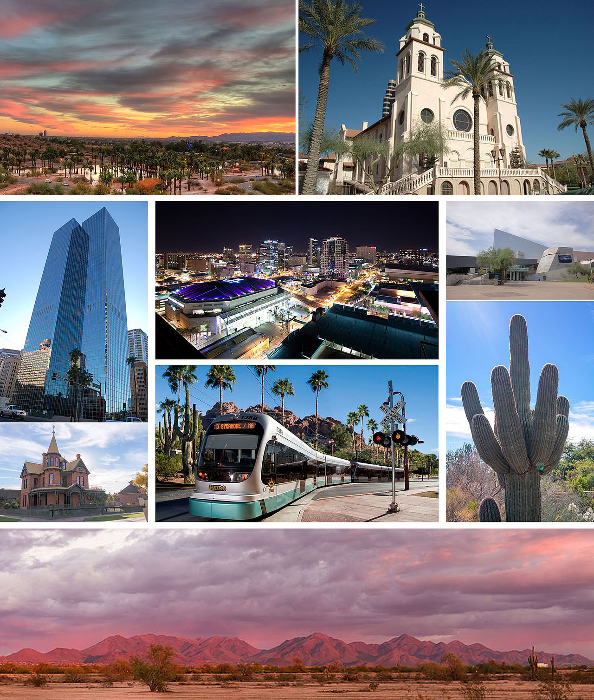

  

*It’s fun to use AI to plan hypothetical trips. (Disclaimer: I have no intention of going on this trip; it’s just a fun exercise.)*

I recently tasked [CoPilot](https://copilot.microsoft.com/) with planning a road trip through Arizona, optimizing for pleasant weather and exciting destinations. Here's the intriguing itinerary it came up with:

## March: Phoenix - The Valley of the Sun 🌞

Fly into Phoenix to kick off your adventure, where the average high temperature is 79°F. Explore the Phoenix Art Museum, the Desert Botanical Garden, and the Phoenix Zoo. Don't forget to wander through the vast South Mountain Park, the largest municipal park in the country. The elevation of Phoenix is 1,086 feet.

## April: Tucson - Rich Heritage and Scenic Beauty 🏜️

Head south to Tucson, where the average high temperature is 83°F. Immerse yourself in the city's rich cultural and historical heritage. Visit historic districts, art galleries, and outdoor attractions like Saguaro National Park and Sabino Canyon. The quirky charm of nearby Bisbee, a former mining town, awaits. The elevation of Tucson is 2,389 feet, and the driving distance from Phoenix is 116 miles.

## May: Chiricahua National Monument - Hiking Wonderland 🏞️

Drive east to the Chiricahua National Monument, where the average high temperature is 77°F. Marvel at the rock formations formed by volcanic eruptions millions of years ago. Explore the balanced rocks, spires, and pinnacles while learning about the history and culture of the Apache people. The elevation of Chiricahua National Monument is 5,400 feet, and the driving distance from Tucson is 120 miles.

## June: Canyon de Chelly National Monument - Navajo Culture and Scenic Beauty 🏞️

Head north to the Canyon de Chelly National Monument, where the average high temperature is 87°F. Drive along scenic rim drives, hike to the White House Ruin, and join a guided tour to the canyon floor. Witness the towering spire, Spider Rock, sacred to the Navajo. The elevation of the Canyon de Chelly National Monument is 5,500 feet, and the driving distance from Chiricahua National Monument is 200 miles.

## July: Grand Canyon National Park - Majestic Views and Adventure 🏞️

Drive west to the Grand Canyon National Park, where the average high temperature is 85°F. Marvel at the majestic views from the South Rim, hike along the Bright Angel Trail, and join a rafting tour on the Colorado River. Explore the Grand Canyon Village with its historic buildings and museums. The elevation of the Grand Canyon National Park is 7,000 feet, and the driving distance from Canyon de Chelly National Monument is 250 miles.

## August: Flagstaff - Gateway to Natural Wonders 🌲

Head south to Flagstaff, where the average high temperature is 77°F. Visit the Lowell Observatory, the Museum of Northern Arizona, and the Riordan Mansion State Historic Park. Explore the San Francisco Peaks, the highest mountain range in the state, and the diverse landscapes of Coconino National Forest. The elevation of Flagstaff is 6,910 feet, and the driving distance from Grand Canyon National Park is 80 miles.

## September: Sedona - Red Rocks and Spiritual Energy 🏜️

Drive south to Sedona, where the average high temperature is 90°F. Admire the stunning red rocks, visit the Chapel of the Holy Cross and the Sedona Heritage Museum, and indulge in spa treatments. Join a jeep tour, a hot air balloon ride, or a vortex tour to experience the spiritual energy of Sedona. The elevation of Sedona is 4,326 feet, and the driving distance from Flagstaff is 29 miles.

## October: Lake Havasu - Relaxation and Scenic Beauty 🏞️

Head west to Lake Havasu, where the average high temperature is 87°F. Relax on the beaches, enjoy the nightlife, and see the iconic London Bridge. Hike or bike along the trails in Lake Havasu State Park and Havasu National Wildlife Refuge. The elevation of Lake Havasu is 735 feet, and the driving distance from Sedona is 200 miles.

## November: Yuma - Wild West History and Sunny Days 🌅

Drive south to Yuma, where the average high temperature is 79°F. Learn about the town’s role in the Wild West, visit the Yuma Territorial Prison State Historic Park, and enjoy fresh produce from local farms. Cross the border to Mexico and experience the culture and cuisine of Algodones. The elevation of Yuma is 138 feet, and the driving distance from Lake Havasu is 129 miles.

## December: Phoenix - Journey's End 🏠

End your unforgettable trip in Phoenix, where the average high temperature is a mild 66°F. Revisit the Phoenix Art Museum, the Desert Botanical Garden, and the Phoenix Zoo. Explore the South Mountain Park once more, reflecting on the memories of your incredible road trip. The elevation of Phoenix is 1,086 feet, and the driving distance from Yuma is 184 miles.

*Total driving distance of this hypothetical adventure: 1,533 miles within Arizona.*

**👍 What do you think?** Did the AI do a good job? Would you take this trip?
