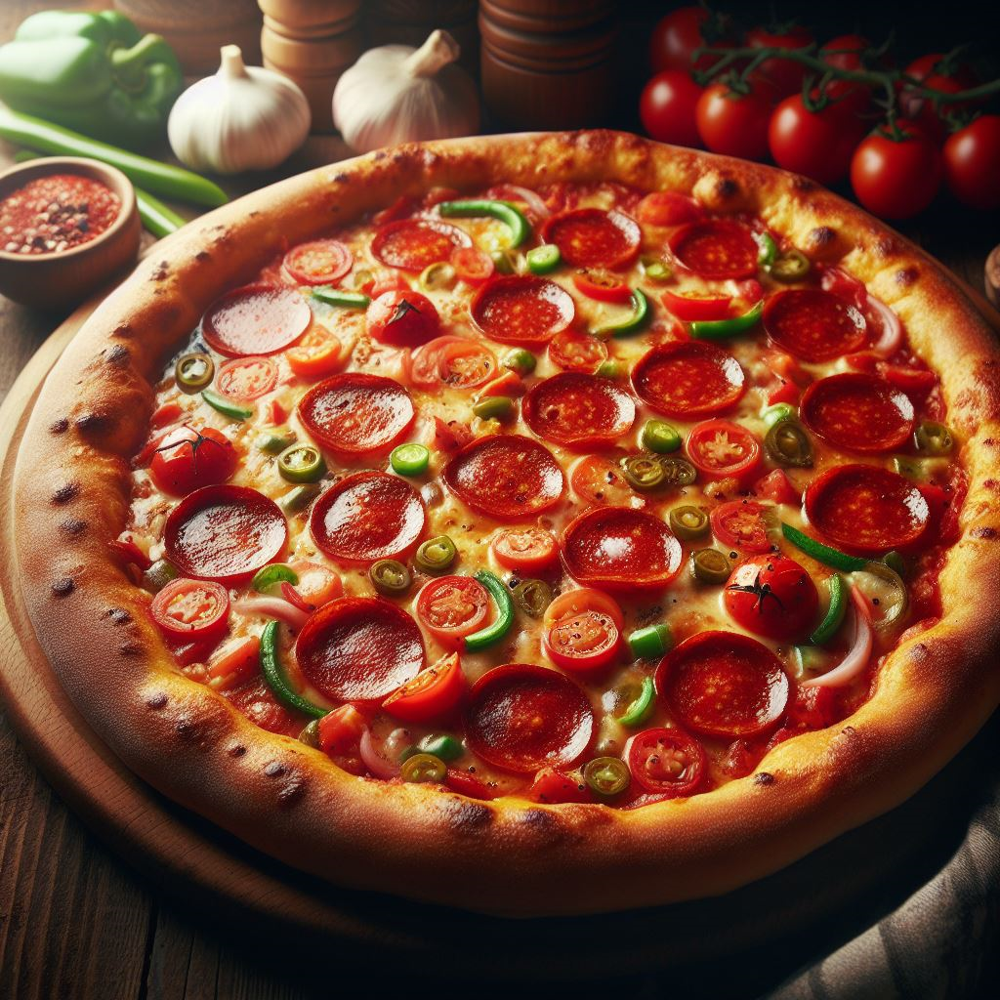

  

Pizza lovers, rejoice! Today marks [National Pizza Day](https://www.usatoday.com/story/money/food/2024/02/08/national-pizza-day-2024-specials-deals/72422384007/), a celebration of one of the world's most beloved and versatile dishes. Let's delve into the origins of this delightful day and explore ways to make it special by supporting local pizzerias.

## A Brief History of National Pizza Day

National Pizza Day is observed annually on February 9th. While its exact origins are a bit hazy, it's clear that the day has become a global celebration of all things pizza. Whether you prefer classic Margherita, meat-lover's extravaganzas, or creative vegetarian options, National Pizza Day is the perfect excuse to indulge in your favorite pie.

## How to Celebrate

### 1. **Visit Your Local Pizzeria**

Instead of opting for chain pizza, take this opportunity to support local businesses. Visit your neighborhood pizzeria and savor a freshly baked, locally crafted pizza. Not only does this contribute to your community, but you'll likely discover unique and delicious flavors.

### 2. **Host a Pizza Party**

Gather friends and family for a pizza party at home. Experiment with various toppings, try making your own dough, and have a friendly competition for the most creative pizza. It's a fun and delicious way to celebrate the day.

### 3. **Share the Love on Social Media**

Snap photos of your pizza celebrations and share them on social media using the hashtag #NationalPizzaDay. Connect with other pizza enthusiasts and discover new recommendations for must-try pizza joints.

### 4. **Try a New Flavor**

Step out of your pizza comfort zone and try a flavor you've never had before. Whether it's a specialty pizza from your local shop or a homemade creation, embracing new tastes adds excitement to the celebration.

### 5. **Gift a Pizza**

Spread the joy by surprising a friend, neighbor, or coworker with the gift of pizza. It's a simple gesture that can brighten someone's day and share the love of this universally cherished dish.

## Local Pizza Picks

In the spirit of National Pizza Day, I can't help but share my personal favorites.

- [**Partners II Pizza (Downtown Woodstock)**](https://www.partnerspizza.com/woodstock-ga)
  - _Five Cheese Classic White Pizza_
  - Made with Mozzarella, ricotta, provolone, feta, parmesan, and garlic sprinkles. Yum!

- [**Ipp's Pastaria (Woodstock)**](https://www.ippspastaria.com/woodstock-home)
  - _George's Grilled Pizza_
  - Made with Italian sausage, tri-colored peppers, caramelized onions, mozzarella cheese, and marinara sauce. Only comes in medium!

- [**Dina's Family Restaurant (Woodstock)**](https://dinasfamilyrestaurant.my.canva.site/)
  - _White Chicken Pizza_
  - Made fresh with 100% real cheese (ricotta, mozzarella, white cheddar & parmesan), fresh ingredients, and daily homemade dough. A unique twist with no red sauce.

## Conclusion

National Pizza Day is more than just an excuse to enjoy a slice; it's an opportunity to celebrate local businesses, embrace culinary creativity, and connect with fellow pizza enthusiasts. Whether you're a thin-crust enthusiast or a deep-dish devotee, let's raise a slice to the joy of pizza on this delicious day!

**Share with us:** How are you celebrating National Pizza Day today? Share your plans and favorite pizza memories in the comments below. 🍕✨
