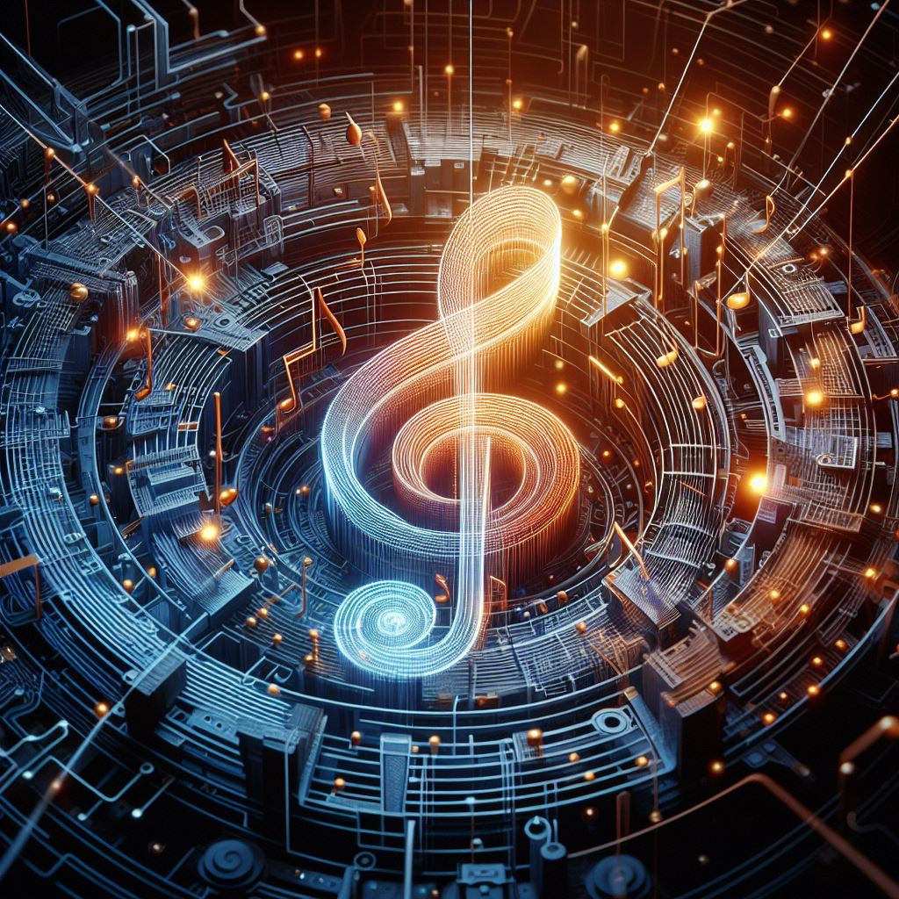

  

Step into the future of music creation, where artificial intelligence orchestrates a revolution. In this article, I explore the transformative power of AI in music, focusing on cutting-edge platforms like [LANDR](https://www.landr.com/) that are redefining the art of audio mastering.

## Exploring the Promise of AI Music Tools

Tools like LANDR leverage machine learning algorithms to automate parts of the music production process that typically require extensive human expertise. For example, LANDR's AI system can analyze a music track and make subtle adjustments to the equalization, compression, stereo imaging, and more to polish and professionalize the audio. This is a process called "audio mastering" that usually takes years for an expert engineer to learn.

The implications are huge. These AI tools have the potential to:

- Lower barriers for new artists looking to put out professional quality tracks without expensive mastering services.
- Save producers time by automatically mastering tracks to a commercially viable sound.
- Open up new creative possibilities by allowing for rapid experimentation with different mastering styles.

## Addressing Concerns About Replacing Human Creativity

However, there are also some valid concerns about the rise of these AI tools:

- Over-reliance on algorithms may reduce diversity and innovation from human creators.
- The artistry and subjectivity of human mastering engineers may be diminished.
- Issues like copyright infringement or oversaturation of AI music could occur.

Ensuring AI promotes rather than hinders creativity will be an important issue going forward.

## LANDR: Democratizing Mastering

As a leading company in this space, LANDR aims to make professional mastering accessible to more emerging artists. Their automated web-based tool lets users master tracks in seconds without needing years of expertise.

The reception has been largely positive, though some skepticism remains about AI replacing the artistry of top human mastering engineers, at least for now. But for amateur producers, this technology finally enables competitively mastered tracks at an affordable price point.

The march of AI music innovation seems unstoppable. LANDR and similar tools are sure to influence production trends in the years to come. But balancing the pros and cons of automation and human creativity will remain an evolving challenge.

The melody of AI in music creation is still unfolding. How do you envision the future of AI's role in the music industry? Share your thoughts in the comments below. 🎵🤖 
