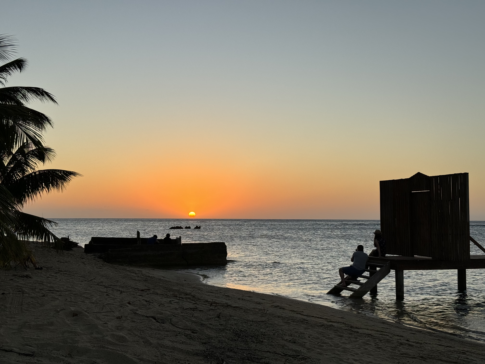

  

This is my first blog post on my exploration of the island of Roatan, hopefully my words and pictures can help share the beauty of sun, sea, and island life.

## Arrival at RTB Airport

The adventure begins as I land at RTB (Roatan airport), where the stark differences from my departure at ATL airport become evident. Disembarking directly onto the tarmac, the warm Caribbean air welcomes me, making me regret my choice of blue jeans for travel. Navigating through customs, filled with excited tourists, I catch snippets of SCUBA diving chatter, highlighting Roatan's reputation as a great diving destination with accessible reefs and affordable certification.

Customs entry is a breeze with a pre-completed online declaration. Once my luggage is secured, an interesting "econo-box" awaits as our chosen mode of transportation, showcasing the unique aspects of island life, from hanging wiring to a laid-back approach to traffic rules.

## Grocery Shopping Island Style

Adjusting to "island time," our first stop includes a grocery store adventure. Limited options teach the lesson of buy today or wait until tomorrow, a unique aspect of island living. Armed guards in the store, add a distinctive touch. Our grocery haul boxed by friendly locals, we tip them generously for their assistance.

## Settling into Airbnb

Navigating dirt roads, we reach our Airbnb, perched on the second story of a townhouse right on the water. My journey is rewarded with a beach view and the sound of horses from a nearby resort. As I put away my belongings, the charm of the locale sinks in.

## Beach Exploration and Sunset Dining

Shorts on, I head to the beach, witnessing horses on the shore and the novelty of driving on the beach – it's an actual named road on the map! The beach strip, lined with dive shops, restaurants, and lodgings, reveals Roatan's love for diving. Although I refrain from water adventures on Day 1, the promise of tomorrow lingers.

Returning to the Airbnb for rest, we decide on a nearby restaurant for dinner, treated to a beautiful sunset over the water during the 5-minute walk. Embracing "island time" once more, the restaurant offers a laid-back atmosphere, where no one is in a hurry. Opting for grilled chicken with plantains, I pay with ease using my credit card, appreciating the affordability of the meal compared to home.

Walking back in darkness, illuminated by phone flashlights, the allure of Roatan at night sets in. Sleepiness takes over, a testament to the day's adventure and the anticipation of more to come.

## Google Photos Album

For a visual glimpse of my Roatan adventure, check out my [Google Photos album](https://photos.app.goo.gl/rJ4fRqyrogQrrALG7)

## Conclusion

Day 1 in Roatan unveils the island's unique charm – from the quirks of transportation and grocery shopping to the beach's vibrant life and tranquil nights. Stay tuned for more tales of sun-soaked exploration in this Caribbean paradise!

**Share with me:** Have you ever experienced the magic of Caribbean life? Share your island adventures and tips for exploring hidden gems!
