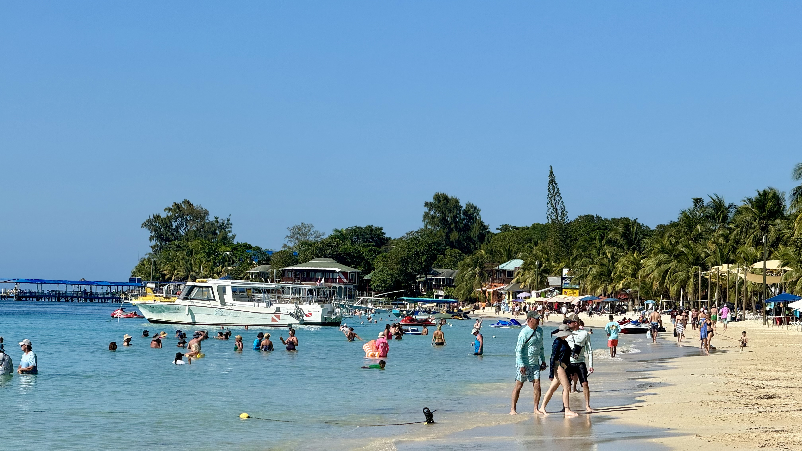

  

Greetings from sunny Roatán! Today was another amazing day filled with exploration and unexpected treats. Buckle up, because I'm about to take you on a journey through my second day in the jewel of the Bay Islands.

## Morning Magic:

Waking up refreshed, my day started early, with a simple breakfast of hot tea and instant grits (a Southern touch I packed from home) and a serene ocean view from my patio. With the warm Caribbean breeze flowing over my face, I couldn't help but wonder why anyone would choose cold weather when places like this exist.

## Writing on the Road:

Taking advantage of the quiet morning, I got out my iPad and penned yesterday's [blog post](https://charleshood.net/posts/exploring-roatan-island-adventures/) (check it out if you haven't already!). Reflecting on my experiences helps me truly savor them, and who knows, maybe someone out there enjoys reading them too.

## Dive, Dive, Dive!:

After our crew assembled and fueled up, we huddled, making plans for the day. The decision? Explore West End, check out dive shops, and venture into the renowned snorkeling haven of West Bay. We started out in West End, where my friend's quest for SCUBA certification led us to a man named "Tuna" (I'm not kidding) at [Splash Inn Dive Resort](https://roatansplashinn.com/en/about-our-dive-center/), where he sealed the deal for classes. While he gears up for his underwater adventures later in the week, I'll be sticking to snorkeling (more on that later!).

## Chocolate Bliss:

No trip to Roatán is complete without a visit to [The Roatan Chocolate Factory](https://theroatanchocolatefactory.com/). Though I didn't buy any for fear it would melt in the car, their 80% dark chocolate was incredible. They offer tours during the week too, so I'll be back! 

## Snorkeling Ambitions:

With West Bay's reputation as a top snorkeling spot echoing in our heads, we headed over, parking a short walk from the beach. The turquoise water and bustling atmosphere stood in contrast to our quiet Airbnb in Sandy Bay. I admit I was a little apprehensive at first, but Roatán's reefs are too spectacular not to experience. Luckily my buddy is experienced, and was able to give me pointers, so that helped a lot. After gearing up (thanks to my awesome neighbor for loaning me fins, mask & snorkel), I took a deep breath and entered the underwater world.

## Words Fail to Describe:

Immediately it was like entering an alternate realm. The reef lies just offshore and takes almost no effort to reach. Let me tell you, snorkeling is an experience words can't fully capture. Imagine vibrant coral reefs teeming with colorful fish just inches from your face. Schools of blue fish swam beneath me, and I even encountered a Dorie lookalike! The reef's intricate nooks and crannies were fascinating, and navigating them felt like exploring a hidden underwater maze.

## An Hour (Well Spent):

Despite a touch of nervousness at first, we spent a blissful hour underwater, the buoyancy and fins making it surprisingly effortless. By the time we emerged, tired and hungry, I knew this was an experience I'd never forget.

## Super Bowl Fiesta:

Back at the Airbnb, it was time to fuel up for the Super Bowl, which started at 5:30pm here in the Central Time Zone. While not a die-hard fan, I couldn't miss this cultural phenomenon. But before getting sucked into the game, I quickly stepped back down to the beach to capture another stunning sunset. I shared a [video](https://youtu.be/5abvJ3uQ75A?si=kq-vWvPV38acUriF) of it on YouTube, check it out:

<iframe width="560" height="315" src="https://www.youtube.com/embed/5abvJ3uQ75A?si=dAHY1AFuh43ccpIg" title="YouTube video player" frameborder="0" allow="accelerometer; autoplay; clipboard-write; encrypted-media; gyroscope; picture-in-picture; web-share" allowfullscreen></iframe>

## Dude Food & Sweet Surprises:

Nachos were our Super Bowl party's star, assembled with local store-bought ingredients that proved surprisingly delicious. But the real surprise came from our dessert choice, tortilla chips dipped in peanut butter sweetened with honey, showcasing the joy of simple pleasures.

## Gridiron Thrills (Spanish Style):

Despite not following the Chiefs or 49ers closely, I found the game interesting from start to finish. Our local Spanish broadcast let me focus on the plays rather than commentary. The halftime show entertained with Atlanta flavor. And the overtime finish kept things exciting all the way through. While I missed the US commercials, catching up on YouTube is always an option. (Save me some time and share your favorite Super Bowl commercials in the comments!)

## Reflecting & Recapping:

Even though I was tired from the long day, I took a moment before going to bed to write this post while the details remained fresh in my mind. Writing has proven therapeutic so far, whether anyone reads these or not! Sharing my experiences keeps me grounded, and even if it's just for myself, it's time well spent.

## What's Next?:

Tomorrow, my friend Dennis joins the crew, and we'll pick him up at the airport before replenishing our nacho supply. Beyond that, we're embracing the flow of island life. With no concrete plans, we look forward to more Caribbean discoveries. The flexibility is part of the magic here. Stay tuned for more blog posts as the week unfolds!

## Don't forget to:

* Check out my Google Photos album for today's pictures: https://photos.app.goo.gl/PnffAfd4uCFt2XZK8
* Share your favorite Super Bowl commercials in the comments.

Hasta luego!
