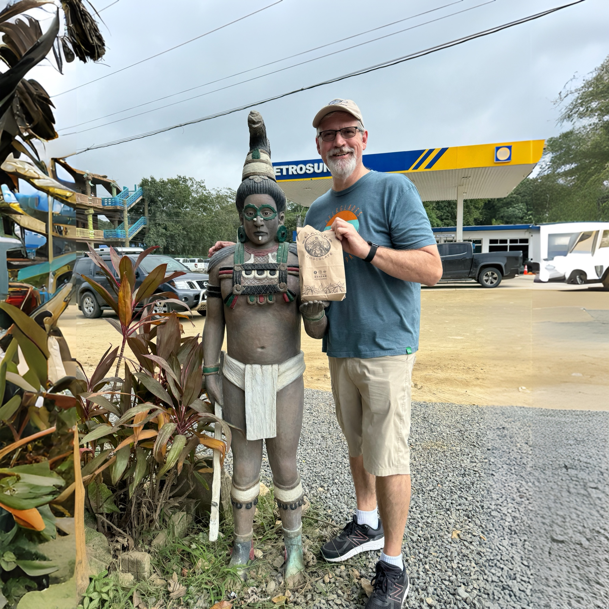
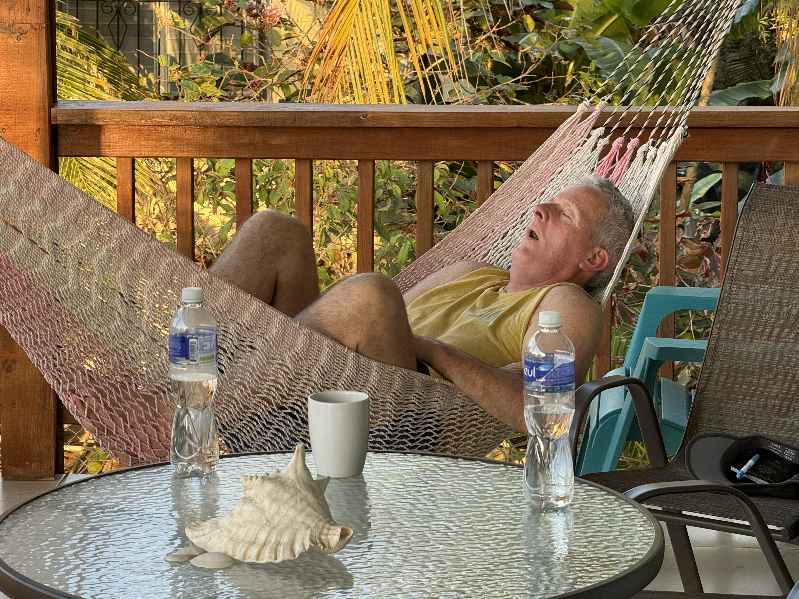
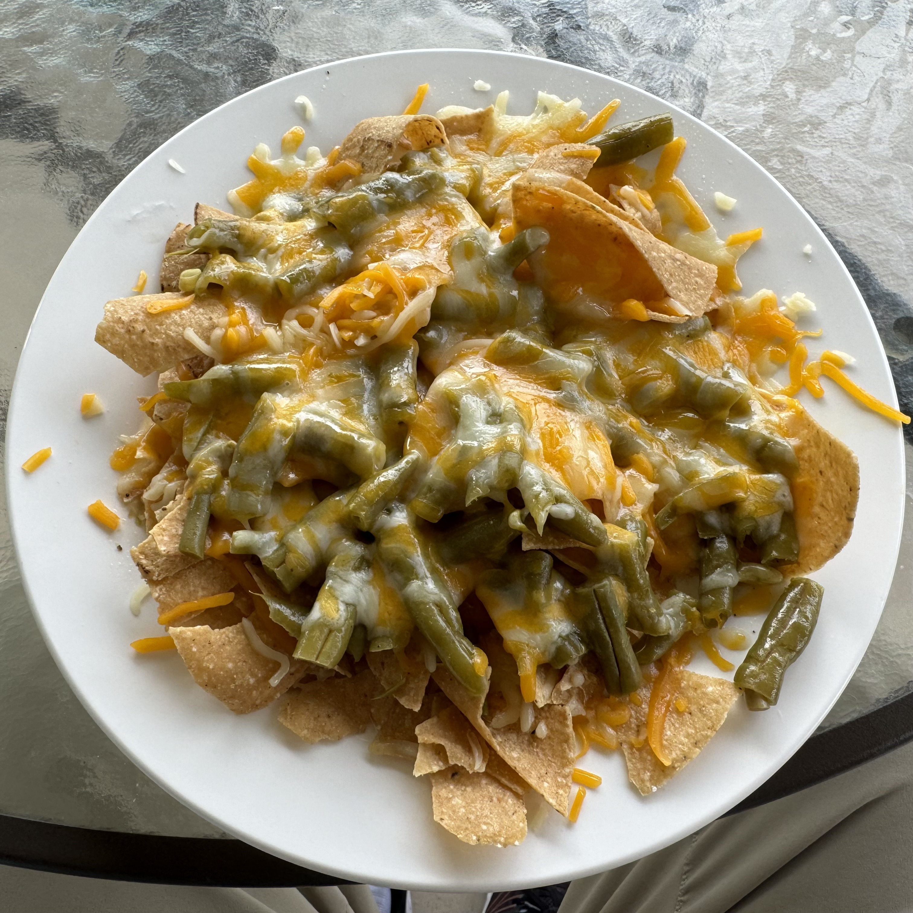

  

Apologies for the lack of updates today; writing a travel blog is harder than it looks! 🤣 Let me catch you up on the latest adventures.

## Welcoming Dennis:

Monday brought the arrival of my buddy Dennis to Roatán, prompting another trip to the airport. Navigating the bustling town of Coxen Hole [Coxen Hole](https://en.wikipedia.org/wiki/Coxen_Hole) provided a traffic chaos spectacle. After some customs delay, we finally enjoyed the 80+ degree sunny day, making Dennis question his choice of a long-sleeved shirt and jeans (traveling from San Francisco). 

Opting for the scenic route back, we stopped by the grocery store for Dennis to stock up on essentials, mainly for more nachos!

After settling in, Dennis embraced the island vibe, crashing hard in the hammock, capturing a priceless moment: 

## Parrot Serenade:

Chilling on the balcony revealed Roatán's diverse birdlife, including lively parrots roosting nearby. Check out the [parrot video](https://youtu.be/6FUgGUnMj4k?si=FxwMSi2TdR1rcniI) to experience their vibrant chatter.

## Sunset and Dinner:

For dinner, we witnessed another stunning sunset on the way to a local restaurant. Attempting time-lapse videography, I captured the moment. Watch the [time-lapse video](https://youtu.be/5abvJ3uQ75A?si=7FCQ6N_Qf1Xg1BeQ) to share the experience.

The evening continued with easy conversation and getting to know each other better. Returning to the Airbnb, we kept it low key—Dennis in the hammock, others engrossed in devices or TV. Simple, agenda-free evenings like these are a true island luxury.

(Don't worry, we didn't leave Dennis in the hammock all night, tempting as it was. 😂)

## Windy Tuesday:

Tuesday brought wind and rain, a change from the calm days. Some of us, working remotely, logged in for a bit. We extended the car rental for flexibility, and after a bit of teleworking, we renewed the rental at the airport. Post-errand, we explored [Mayak Chocolate](https://photos.app.goo.gl/GeYRzhq8rfWxSHNr7), indulging in a chocolate tour and tastings. The 70% dark chocolate won my taste buds!

Returning with our chocolate haul, lunch at the Airbnb featured, you guessed it, more nachos! This time, I may or may not have invented green bean nachos. Yes, you read that right—green beans on nachos. Trust me, they were surprisingly good!

## Writing Retreat:

With the afternoon free, I caught up on blogging, finding it therapeutic to document the day's moments. It felt good to write, and a couple of people actually asked, "Where's the blog update for today?" (Practically going viral! 🤣)

Dinner plans for "Taco Tuesday" will round off another day of conversation and camaraderie. As clouds gather, no sunset photos are expected tonight. With that, I'm signing off. Adios for now!
