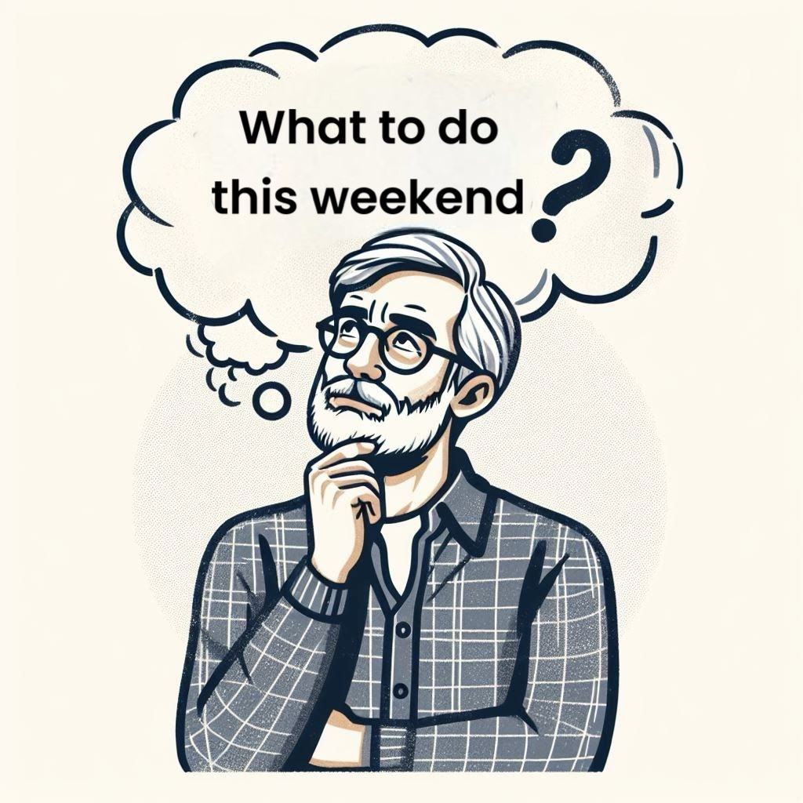

  

It's Friday morning, and the age-old question pops into my mind: "What should I do this weekend? 📅" I want to make the most of my valuable free time, but finding the perfect events and activities isn't as easy as it should be.

### The Facebook Events Dilemma

Like many of us, I often turn to Facebook's "Events" feature for inspiration. However, I've found that it's not always the most reliable or comprehensive source. Some events are difficult to discover, and not everyone posts their happenings on the platform. It's frustrating to feel like you might be missing out on something great. #FOMO

### Following Venues and Organizations

Another approach is to follow specific venues or organizations that align with your interests. But let's be honest, constantly checking multiple websites and hoping they're up-to-date is a time-consuming and tedious process. It's easy to get discouraged when you can't find the information you need.

### The Well-Connected Friend

Then there are those enviable individuals who always seem to be in the know – the ones who have their finger on the pulse of our area's coolest events. We all have that one friend who's incredibly well-connected and can rattle off a list of must-attend gatherings at a moment's notice. But as much as I appreciate their expertise, I don't want to feel like I'm constantly pestering them for recommendations.

### Seeking Reader Input

So, what's the solution? How can we streamline the process of finding worthwhile weekend activities without relying solely on Facebook, endlessly scouring websites, or overburdening our social butterflies?

I'm curious to hear from you, what strategies have you found effective in discovering fun events and experiences? Do you have any go-to resources or insider tips that make the search easier? Maybe you've found success with local blogs or community forums that curate the best happenings around here. Or perhaps you have a system of your own, like a group chat with friends where you share event details or take turns researching and suggesting plans.

### The Potential of Event Discovery Apps

In this digital age, there might even be apps designed specifically to solve this problem. Imagine an app that curates events based on your interests, location, and social connections. It could offer personalized recommendations, allow you to save and share events with friends, and even provide exclusive discounts or perks for attending. While I don't have the coding expertise to write an app like that myself, I believe there is a market opportunity to improve the way we discover and plan our weekend activities. Someone get work on making this happen, please! 😉

So, let's help each other out: How do YOU decide what to do for the weekend? Share your tried-and-true methods, favorite resources, and any good ideas in the comments below. Maybe together we can crack the code on making the most of our weekends without the stress of the search.

