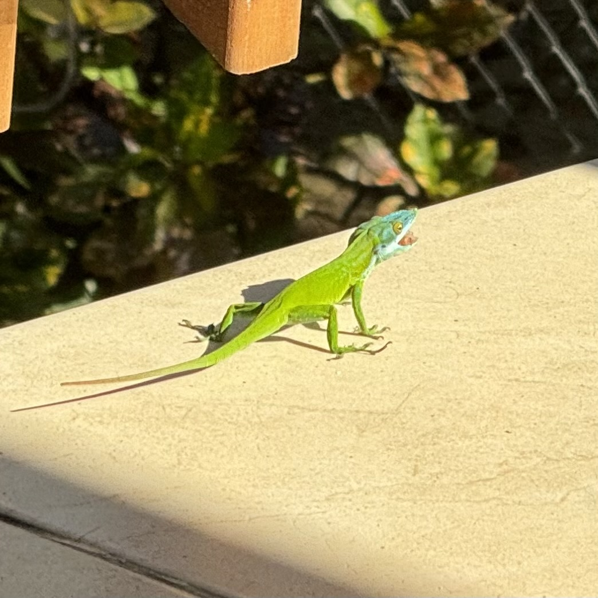
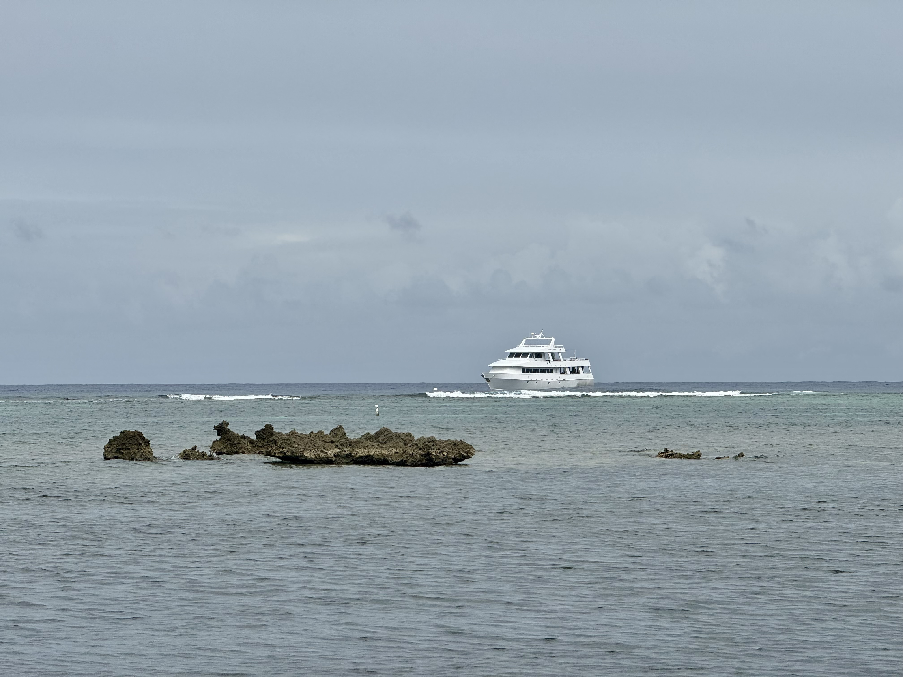
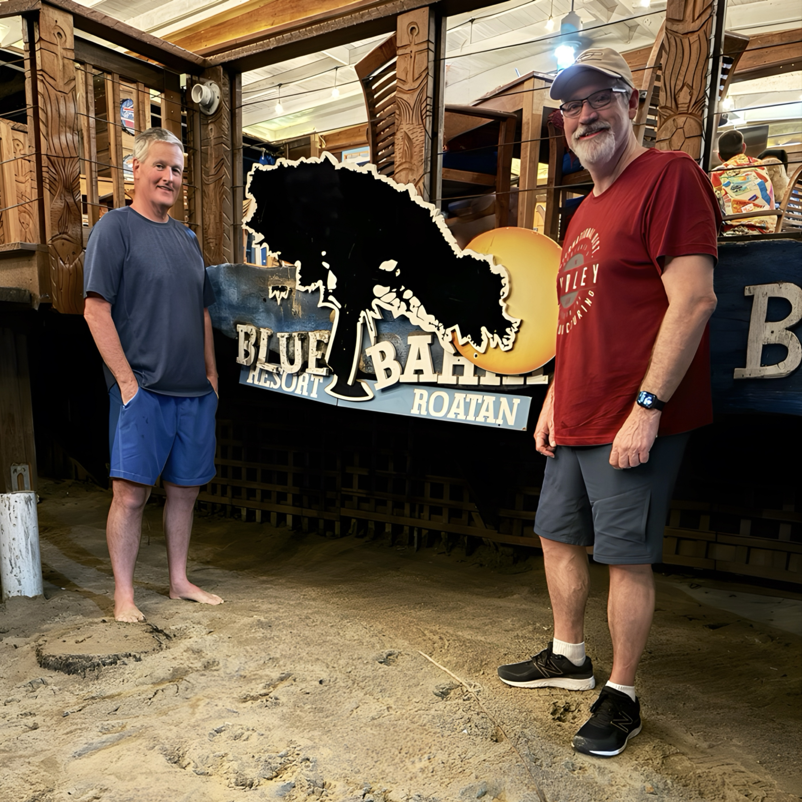

Every day in Roatán has been a celebration of simplicity. Here's a glimpse into the moments that made my island escape pretty unforgettable:

## Lazy Days in Paradise:

My friend group and I cherished the luxury of doing nothing, savoring the extraordinary weather that felt like a dream for a February escape. The absence of a constant need to be on the go allowed us to immerse ourselves in relaxed conversations, share stories, and simply enjoy the breeze. The nearby resort brought regular sightings of people on horseback, adding a unique rhythm to the peaceful scene outside our patio.

## Geico on the Porch:

Our porch became a stage for nature's comedy as a lizard, reminiscent of the Geico gecko, made an appearance. Quick and cunning, it snatched a nacho in a blink of an eye, leaving us amused and reaching for our cameras.

## Beach Strolls and Sunset Views:

Daily walks to the beach became a favorite routine. Whether cooling off in the water, savoring the view, or witnessing the mesmerizing sunset, each stroll was a reminder of the island's natural beauty.

## Melodies under the Stars:

Thursday night led us to [Blue Bahia Beach Grill](https://beachgrillroatan.com/), where live music filled the air. The keyboard player, hailing from Sweden, impressed the crowd with his knowledge of thousands of songs. The local songstress, tambourine in hand, added a rhythmic touch. Requests flowed, from Bon Jovi to Johnny Cash, proving that music transcends borders.

## A Guy's Trip Retreat:

This "guy's trip" bestowed a precious gift of mental clarity. As I prepare to bid farewell to this Caribbean retreat on Saturday, the pace of island life has left an indelible mark. An unspoken plan hovers, looking forward to reliving this calm on future buddy trips to other tropical havens.

I’m parting ways with Roatán for now, but the memories of this place will stay with me until the next adventure calls. If you want to recap the visual journey, check out the latest photo album from this trip on [Google Photos](https://photos.app.goo.gl/97bDJTrjULr3H3yK8).
