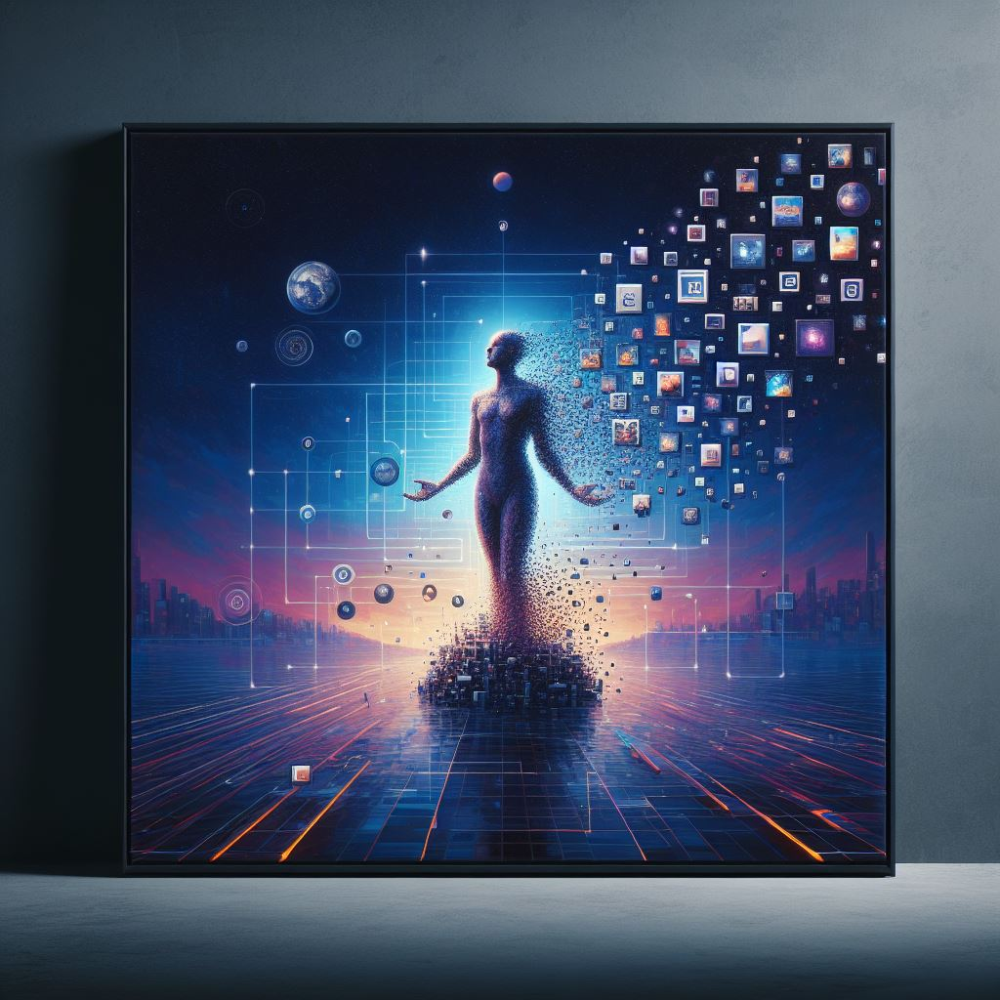

  

In our ever-connected world, finding tranquility amid the digital chaos is an art form. Let's explore the practical steps of digital minimalism and discover how they can bring a sense of peace to our daily lives. 🧘‍♂️

## Introduction

In a world dominated by digital noise, the practice of digital minimalism becomes a beacon of peace and intentionality. Before we delve into the steps, let's understand why this journey matters. Digital minimalism is not just about decluttering; it's about reclaiming our time, attention, and mental well-being in a world overflowing with information.

## 1. Take a Peek at Your Digital Jungle

As you embark on your digital decluttering journey, consider keeping a lean selection of essential apps on your phone—perhaps around 20-25. Be ruthless in evaluating their necessity. Also, experiment with turning off notifications during specific focused hours, like work hours or quality family time in the evening.

## 2. Set Some Digital Boundaries

Define your digital boundaries by aligning them with your lifestyle. Perhaps set your phone to "Do Not Disturb" mode after a certain hour. Communicate your digital boundaries with those around you to create a supportive environment. Experiment with a digital detox day, picking a weekend to disconnect entirely and immerse yourself in analog experiences.

## 3. Curate Your Digital Toolbox and Social Media

Imagine your phone as a minimalist toolbox—keep only the tools you truly need. Consider categorizing apps into folders for a more organized and visually appealing layout. When streamlining social media, unfollow accounts that don't add value to your digital experience. Aim for quality over quantity.

## 4. Be a Mindful Content Consumer

Curate your content consumption just like you curate your snacks. Follow blogs, podcasts, or newsletters that genuinely enrich your knowledge and well-being. Practice digital decluttering by unsubscribing from email newsletters that no longer serve your interests or goals.

## 5. Embrace Analog Vibes

Rediscover analog activities, such as reading physical books or journaling with a pen and paper. Create tech-free zones in your home, starting with your bed. Let these spaces be sacred, allowing your mind to unwind without the glow of screens.

## 6. Zen Mode

Practice single-tasking to enhance focus and productivity. Before scrolling through social media, ask yourself if the content is worth your time and mental energy. Consider setting a timer for your social media use to stay mindful of your screen time.

## 7. Reflect and Tweak

Regularly reflect on your digital habits and their alignment with your life goals. Celebrate small victories and be open to experimentation. For instance, try a week without a specific app or a month with reduced screen time, and assess the impact on your well-being.

In conclusion, the art of digital minimalism is about finding peace and purpose in a digital world. 🌟📱 As you incorporate these steps into your life, may you discover a profound sense of tranquility amidst the digital hustle. Happy digital decluttering!
