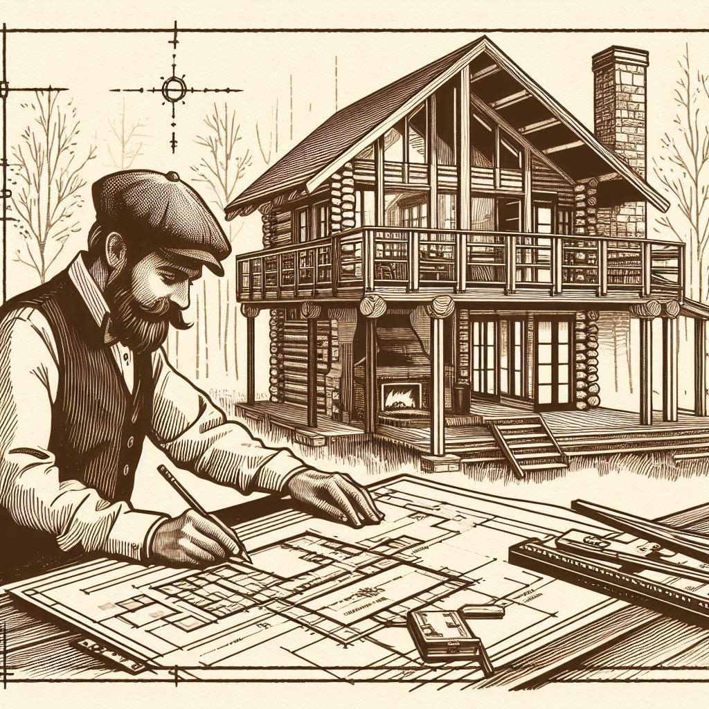

  

I'm here to confess something: I have a strange obsession with looking at floor plans online. Maybe it's the glimpse into different lifestyles, the spark of inspiration, or the chance to imagine myself living in a different space. Whatever the reason, I find myself scrolling through endless floor plans, daydreaming about the possibilities.

Recently, I stumbled upon a cabin called the [Trahlyta cabin](https://www.instagram.com/trahlyta_cabin/) in Dahlonega, Georgia, and let me tell you, it has taken my floor plan obsession to a whole new level! I found it while browsing YouTube (link: [https://youtu.be/_uxi4dX6xCI?si=U7XkzSuETPPh44PP](https://youtu.be/_uxi4dX6xCI?si=U7XkzSuETPPh44PP)) and was immediately captivated by its design and layout.

What is it about this cabin that has me so intrigued? First of all, the size. At 900 square feet, it hits the sweet spot for me. It's not too small and cramped like some tiny homes I've seen, but it's also not a sprawling mansion. It feels just right, offering a cozy and manageable living space.

Secondly, I love the "roommate plan." The bedrooms on either side are practically identical, making it perfect for sharing with a friend or family member without any arguments about who got the better room. Plus, each bedroom has its own mini-split unit, ensuring individual climate control – no more fighting over the thermostat!

Speaking of the outdoors, the back half of the cabin is a full deck, accessible from both bedrooms through their own doorways. It even has a little overhang for shade on sunny days. And let's not forget the fact that the cabin is built on pilings. This not only protects against potential flooding but also seems perfect for uneven terrain.

Finally, the overall aesthetic of the Trahlyta cabin just speaks to me. It has a modern, clean-lined design that I find incredibly appealing. While I wouldn't mind adding a carport off to the side for additional storage and shelter, the cabin itself is pretty much perfect in my eyes.

Now, I know what you might be thinking: "Is Charles really serious about living in a tiny cabin?" Honestly, I'm not entirely sure. But what I do know is that the Trahlyta cabin has sparked a dream in me for a simpler life. It's a reminder that living large doesn't always mean needing a lot of space.

So, tell me, are you a fellow floor plan dreamer? Have you ever come across a design that has captured your imagination? Share your thoughts and favorite finds in the comments below! Let's keep the dream alive together.